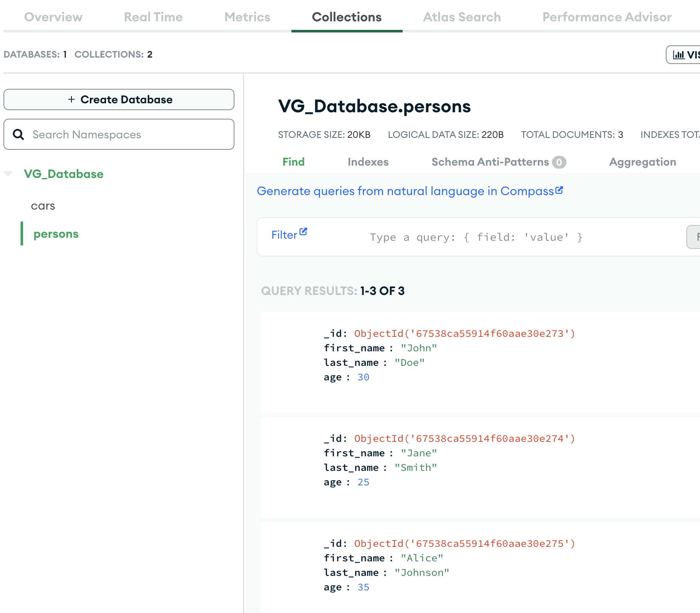
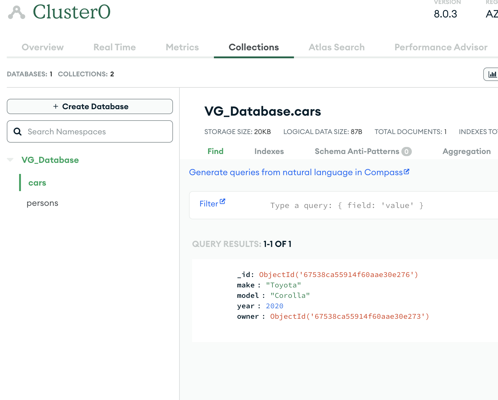
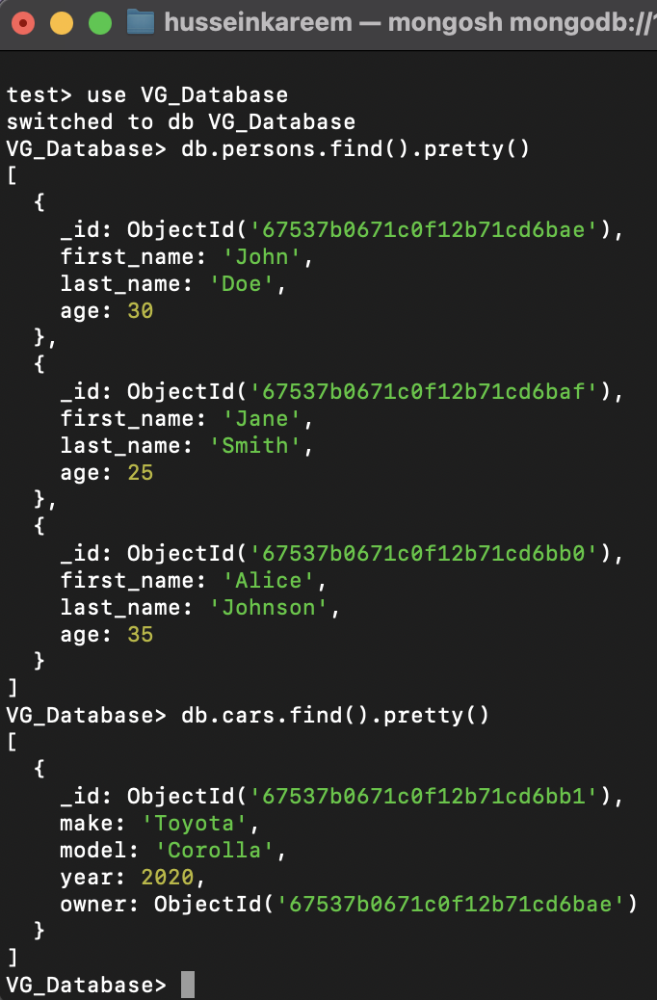

# MongoDB Databas Ex

## **Introduktion**
Denna lösning implementerar en MongoDB-databas med följande funktioner:
1. En collection `persons` innehåller data om personer och har ett sammansatt index på fälten `first_name` och `last_name`.
2. En collection `cars` innehåller data om bilar, där varje bil refererar till en ägare i `persons` via ObjectId.
3. Queries som kopplar data mellan `cars` och `persons` med `$lookup`.

Lösningen testades både **lokalt** och på **MongoDB Atlas**.

## **Funktionalitet**
- Skapar databasen och collections i MongoDB.
- Infogar data i collections och ställer frågor med hjälp av Python.
- Utför kopplingar mellan collections för att demonstrera relationer.

## **Installation**

### **1. Förberedelser**
- **Installera MongoDB lokalt**:
  1. Installera Homebrew (om det inte redan är installerat):
     ```bash
     /bin/bash -c "$(curl -fsSL https://raw.githubusercontent.com/Homebrew/install/HEAD/install.sh)"
     ```
  2. Installera MongoDB:
     ```bash
     brew tap mongodb/brew
     brew install mongodb-community@6.0
     brew services start mongodb/brew/mongodb-community@6.0
     ```

- **Installera Python och pymongo**:
  1. Kontrollera att Python är installerat:
     ```bash
     python3 --version
     ```
  2. Installera `pymongo`:
     ```bash
     pip3 install pymongo
     ```

### **2. Anslutning till MongoDB Atlas**
1. Skapa ett konto på [MongoDB Atlas](https://www.mongodb.com/cloud/atlas).
2. Skapa ett gratis `M0 Free Tier` cluster.
3. Lägg till din dator-IP i **Network Access**:
   - IP-adress: `81.237.194.73/32`.
4. Skapa en användare i **Database Access** med rättigheter för att läsa och skriva.

## **2. Kör Python-skriptet**
1. Navigera till mappen där skriptet är sparat:
   ```bash
   cd /path/to/your/script


---

### **Del 5: Skärmdumpar**

```markdown
## **Skärmdumpar**
### **1. Data från MongoDB Atlas**
- **`persons` collection:**
  
- **`cars` collection:**
  

### **2. Terminalutdata från `mongosh`**
- **Query för `persons` och `cars` collection:**
  

### **3. Python-skriptets terminalutdata**
- **Index och data för `persons` & Lookup-query mellan `cars` och `persons`:**
  

## **Testad funktionalitet**
### **1. Sammansatt index**
- Ett sammansatt index skapades i `persons` på fälten `first_name` och `last_name`.
- Detta testades genom queries som använder indexet.

### **2. Referenser mellan collections**
- Varje bil i `cars` refererar till en ägare i `persons` via ObjectId.
- Detta verifierades genom en `$lookup`-query som kopplar bil och ägare.

### **3. Queries**
- Queries testades framgångsrikt för att:
  - Hämta data från `persons`.
  - Hämta data från `cars`.
  - Koppla data mellan `cars` och `persons` via en `$lookup`.

## **Resultat**
- Databasen och queries testades framgångsrikt både lokalt och i MongoDB Atlas.
- Dokumenten i collections (`persons` och `cars`) är korrekta och kopplade via ObjectId.
- Sammansatt index användes för att optimera queries i `persons`.

## **Slutsats**
Lösningen implementerar en fungerande MongoDB-databas med:
1. Ett sammansatt index i `persons`.
2. Relationer mellan `cars` och `persons` via ObjectId.
3. Testad funktionalitet både lokalt och i MongoDB Atlas.